# Reentry

Reentry is a Python harness for CCSDS Space Packet conformance and robustness testing. It builds and validates Space Packets, generates deterministic malformed and boundary-value inputs, delivers them over UDP, and reports whether a target rejects them safely or becomes unresponsive or unexpectedly accepts them.

See [ROADMAP.md](ROADMAP.md) for project direction.

## Status

The current implementation targets CCSDS Space Packets and provides:

- Primary-header packing, unpacking, and validation
- Deterministic boundary cases for malformed and degenerate packets
- A pluggable transport interface with a UDP adapter
- Liveness and ci_lab counter-based oracle implementations
- JSON and JUnit XML reports
- Report provenance including harness version, target metadata, configuration hash,
  adapter, telemetry schema, and resolved target identifiers
- A CLI: `reentry run` and `reentry list-cases`
- A local mock target for fast development
- A Docker build for the cFS/ci_lab validation target

## Architecture

```mermaid
flowchart LR
    subgraph INPUT["Run definition"]
        CLI["CLI: reentry run"] --> CONFIG["RunConfig<br/>TOML and Pydantic validation"]
        CONFIG --> PROFILE["TargetProfile<br/>case selection"]
    end

    subgraph EXECUTION["Test execution"]
        RUNNER["Runner"] --> GENERATOR["Boundary-case generator<br/>generate_all()"]
        GENERATOR --> CASE["PacketCase<br/>expected outcome + raw bytes"]
        CASE --> RETARGET["Optional APID retargeting<br/>checksum preservation"]
        RETARGET --> TRANSPORT["Transport interface<br/>UDPTransport"]
    end

    subgraph OBSERVATION["Target observation"]
        TARGET["System under test<br/>mock target or cFS/ci_lab"]
        REPLY["Reply or timeout"]
        TELEMETRY["Telemetry evidence<br/>before/after counters"]
        ORACLE["Oracle implementation"]
        VERDICT["OracleResult<br/>verdict + evidence + transport status"]
        TARGET --> REPLY
        TARGET --> TELEMETRY
        REPLY --> ORACLE
        TELEMETRY --> ORACLE
        ORACLE --> VERDICT
    end

    subgraph OUTPUT["Reports and CI results"]
        FINDING["Finding<br/>case + verdict + detail"]
        JSON["JSON report"]
        JUNIT["JUnit XML report"]
        FINDING --> JSON
        FINDING --> JUNIT
    end

    PROFILE --> RUNNER
    RUNNER --> TRANSPORT
    TRANSPORT --> TARGET
    ORACLE -.-> LIVE["LivenessOracle<br/>health only"]
    ORACLE -.-> CILAB["CiLabOracle<br/>counter deltas"]
    VERDICT --> FINDING
```



The cFS/ci_lab integration is a separate, heavier validation path. Its generated message IDs are resolved from the actual cFS build rather than guessed.

For a local cFS run, build and start the image with Docker Desktop, then use the
host-side helpers to resolve IDs, enable TO_LAB telemetry, and render the config:

```sh
docker build -t cfs-ci-lab docker/cfs_ci_lab
# Bind ci_lab's command port only on the host loopback interface.
docker run -d --name cfs-ci-lab --privileged --sysctl fs.mqueue.msg_max=1024 --add-host=host.docker.internal:host-gateway -p 127.0.0.1:1234:1234/udp cfs-ci-lab
docker cp cfs-ci-lab:/cfs/generated_headers /tmp/generated_headers
python docker/cfs_ci_lab/resolve_ids.py /tmp/generated_headers /tmp/resolved_ids.json
TELEMETRY_SOURCE=$(docker inspect -f '{{range .NetworkSettings.Networks}}{{.IPAddress}}{{end}}' cfs-ci-lab)
python docker/cfs_ci_lab/render_config.py /tmp/resolved_ids.json /tmp/reentry.toml --allowed-reply-host "$TELEMETRY_SOURCE"
HOST_IP=$(docker exec cfs-ci-lab getent ahostsv4 host.docker.internal | awk 'NR == 1 {print $1}')
python docker/cfs_ci_lab/enable_to_lab.py /tmp/resolved_ids.json --destination-ip "$HOST_IP"
reentry run --config /tmp/reentry.toml --json report.json --junit report.xml
docker rm -f cfs-ci-lab
```

The destination address is discovered from Docker's host gateway, so the same
workflow works on Docker Desktop and Linux. The image exports the build-resolved
CI_LAB and TO_LAB values in `ci_lab_ids.json`, so IDs are never guessed.

## Development

Python 3.11 or newer is required.

```sh
python3 -m venv .venv
source .venv/bin/activate
pip install -e ".[dev]"
python -m pytest -q
```

List the deterministic cases:

```sh
reentry list-cases
```

## Target Profiles

Select a named, reproducible profile with `--profile`:

```sh
reentry run --config target.toml --profile smoke
```

- `smoke` runs the known-good command control for fast valid-command and liveness checks.
- `stock-cfs` runs the complete suite to characterize the target as shipped.
- `hardened-cfs` requires an adapter that reports hardened-policy enforcement and
    the required before/after evidence; current adapters reject this profile rather
    than making an unsupported claim.
- `full-robustness` runs the complete suite and is the default profile used by
    helper scripts unless `REENTRY_PROFILE` is set.

Profiles do not alter observed oracle verdicts. JSON and JUnit reports record
the selected profile, verdict, detail, and per-case telemetry evidence.
`INCONCLUSIVE` remains inconclusive; `UNEXPECTED_ACCEPT`, `HANG`, and `CRASH`
fail the run.

### Target adapter contracts

Each oracle declares an adapter contract in `reentry.harness.adapters`. The
generic liveness adapter reports target health only and has no telemetry schema,
so it cannot distinguish acceptance from rejection. The cFS/ci_lab adapter uses
the version `7.0.1` `ci_lab_housekeeping` schema with these fields:

- `command`
- `command_error`
- `enable_checksums`
- `socket_connected`
- `ingest_packets`
- `ingest_errors`

The cFS adapter maps command-error deltas to `clean_reject`, ingest-error
deltas to `safe_drop`, command deltas to `clean_accept`, missing after-telemetry
to `hang`, and transport failures to `inconclusive`. Neither current adapter
claims hardened-policy enforcement. The runner rejects `hardened-cfs` until the
target exposes a reliable enforcement signal.

Run against the local mock target:

```sh
scripts/run-local.sh
```

Set `REENTRY_PROFILE=smoke` for the fast profile or leave the default
`full-robustness` profile in place.

The script stops the mock target when the run finishes. It uses UDP port `1234`;
set `REENTRY_PORT` if that port is busy:

```sh
REENTRY_PORT=1235 scripts/run-local.sh
```

Run only the known-good CI_LAB NOOP against a target by adding this to a TOML
configuration (use the build-resolved `target_apid` for real cFS):

```toml
include_categories = ["known_good"]
```

An optional external health command can distinguish a crashed target from a
live target that stopped answering its protocol probe. Configure it as an argv
array; exit status 0 means alive and any other status, execution error, or
timeout reports `crash` when the protocol probe also fails:

```toml
health_command = ["docker", "inspect", "--format", "{{.State.Running}}", "cfs-ci-lab"]
```

Without `health_command`, the existing no-response result remains `hang` with
the possible crash ambiguity preserved.

The run must report `clean_accept` and a detail showing `CommandCounter`
increased. The full suite keeps malformed cases separate: `clean_reject`,
`safe_drop`, and `inconclusive` are non-unsafe outcomes; only hangs, crashes,
and unexpected accepts fail the CLI run.

`IngestPackets` is included as diagnostic evidence, but its delta also includes
the HK probes used to read telemetry, so it is not used alone to claim rejection.

Run the intentionally faulty mock target to verify unsafe-result detection:

```sh
scripts/run-local.sh --buggy
```

Run the real cFS/ci_lab target in Docker with the complete setup and cleanup flow:

```sh
scripts/run-cfs-docker.sh
```

The Docker helper uses `full-robustness` by default; set `REENTRY_PROFILE` to
select another named profile.

The Docker workflow runs the complete suite and explicitly verifies that the
known-good NOOP reports `clean_accept` with a `CommandCounter` increase before
cleanup. It also writes `report.json` and `report.xml`; malformed cases that
remain `inconclusive` are recorded there without failing the run by themselves.
The GitHub Actions cFS job runs on a nightly schedule as well as by manual
dispatch and archives the real-target JSON report as baseline evidence.

Reports include a `provenance` object, or matching `reentry.*` JUnit properties,
with the harness version, optional target build and version, resolved target
identifiers, a SHA-256 hash of the validated configuration, adapter name, and
telemetry schema identity.

Compare a new JSON report with a checked-in or downloaded baseline in CI:

```sh
reentry compare --baseline baseline.json --actual report.json --json comparison.json
```

The command exits with status 1 when a case is added, removed, or changes
verdict, and writes deterministic difference records when `--json` is used.
The command-level malformed suite also checks checksum handling. If cFS reports
`EnableChecksums = 0`, the deliberately bad-checksum command is expected to be
accepted and is correctly reported as `unexpected_accept`. The stock cFS v7.0.1
CI_LAB build has no runtime command to enable checksum validation; a clean
rejection for this case requires a custom cFS/EDS target build.

Docker must be running, and host UDP port `1234` must be available. The script
fails immediately if the port is busy, instead of continuing with a stopped
container and producing misleading hang findings. The first Docker build can
take a while because it compiles cFS; later builds use Docker's cache.

## CI

GitHub Actions runs the unit tests and mock-target pre-flight on pushes and pull requests. The cFS/ci_lab Docker validation is available through a manual workflow dispatch. Releases are driven by Conventional Commit messages on `main`.

- `fix:` creates a patch release
- `feat:` creates a minor release
- `BREAKING CHANGE:` creates a major release
