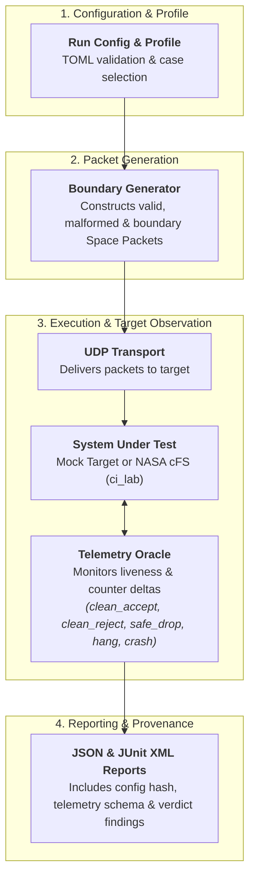

# Reentry

[](LICENSE)
[](pyproject.toml)
[](src/reentry/ccsds/constants.py)
[](https://github.com/juliansden/reentry/actions/workflows/reentry-preflight.yml)

**Reentry** is a high-assurance Python testing harness for CCSDS Space Packet Protocol ([CCSDS 133.0-B-2](src/reentry/ccsds/constants.py)) packet construction, boundary testing, and flight software robustness validation.

It systematically generates deterministic valid, boundary-value, and malformed Space Packets, delivers them over network transports (such as UDP), observes target telemetry before and after packet injection, and evaluates whether the flight software or system under test (SUT) safely accepts, cleanly rejects, or dangerously fails (hangs or crashes).

---

## Table of Contents

- [Overview](#overview)
- [Key Features](#key-features)
- [Architecture](#architecture)
- [Quick Start](#quick-start)
  - [Prerequisites](#prerequisites)
  - [Installation](#installation)
  - [1. Fast Local Run (Mock Target)](#1-fast-local-run-mock-target)
  - [2. Flight Software Validation (NASA cFS)](#2-flight-software-validation-nasa-cfs)
- [CLI Reference](#cli-reference)
- [Configuration & Target Profiles](#configuration--target-profiles)
- [Telemetry Oracles & Adapter Contracts](#telemetry-oracles--adapter-contracts)
- [Provenance & Baseline Comparison](#provenance--baseline-comparison)
- [Development & Testing](#development--testing)
- [Roadmap & Contributing](#roadmap--contributing)
- [License & Standards](#license--standards)

---

## Overview

Flight software must remain resilient against corrupted or malformed Space Packets received over space-to-ground or inter-subsystem data links. Traditional fuzzing can produce non-deterministic or unrepeatable failures. **Reentry** provides:

- **Deterministic Boundary Generation**: Systematically tests packet header boundaries (e.g. invalid packet lengths, sequence count gaps, corrupt APIDs, broken checksums, truncated primary headers).
- **Automated Evidence & Telemetry Oracles**: Captures telemetry counter deltas (`CommandCounter`, `CommandErrorCounter`, `IngestPackets`) to verify whether a packet was processed, rejected, or dropped.
- **Audit-Grade Provenance**: Records harness metadata, target configuration hashes, build-resolved message IDs, and telemetry schemas in structured JSON and JUnit XML reports.

---

## Key Features

- **CCSDS 133.0-B-2 Compliance**: Full support for packing, unpacking, validating primary headers, sequence controls, and optional APID retargeting while preserving packet checksums.
- **Target Profiles**: Pre-configured case suites (`smoke`, `stock-cfs`, `hardened-cfs`, `full-robustness`) for reproducible CI testing.
- **Pluggable Architecture**: Modular transport adapters (UDP) and extensible oracle interfaces.
- **Automated NASA cFS Integration**: Directly parses cFS header build artifacts (`generated_headers`) to resolve `CI_LAB` and `TO_LAB` message IDs dynamically without guesswork.
- **Baseline Drift Detection**: Built-in diff tool (`reentry compare`) to detect regression or unexpected verdict drift against baseline runs in CI pipelines.

---

## Architecture

The diagram below illustrates the end-to-end execution flow of Reentry:



---

## Quick Start

### Prerequisites

- **Python**: 3.11 or newer
- **Docker** *(Optional)*: Required for running NASA cFS (`ci_lab`) containerized validation

### Installation

Clone the repository and install dependencies:

```sh
git clone https://github.com/juliansden/reentry.git
cd reentry

# Create and activate virtual environment
python3 -m venv .venv
source .venv/bin/activate

# Install package in editable mode with development dependencies
pip install -e ".[dev]"
```

Verify installation:

```sh
reentry --help
```

---

### 1. Fast Local Run (Mock Target)

Execute a full robustness suite against an included local Python mock target:

```sh
scripts/run-local.sh
```

To test failure detection against an intentionally buggy target:

```sh
scripts/run-local.sh --buggy
```

---

### 2. Flight Software Validation (NASA cFS)

Run the full robustness suite against NASA Core Flight System (cFS) `ci_lab` in Docker:

```sh
scripts/run-cfs-docker.sh
```

Or execute step-by-step manually:

```sh
# 1. Build and start the cFS ci_lab Docker container
docker build -t cfs-ci-lab docker/cfs_ci_lab
docker run -d --name cfs-ci-lab \
  --privileged \
  --sysctl fs.mqueue.msg_max=1024 \
  --add-host=host.docker.internal:host-gateway \
  -p 127.0.0.1:1234:1234/udp \
  cfs-ci-lab

# 2. Extract generated build headers and resolve message IDs
docker cp cfs-ci-lab:/cfs/generated_headers /tmp/generated_headers
python docker/cfs_ci_lab/resolve_ids.py /tmp/generated_headers /tmp/resolved_ids.json

# 3. Render test configuration and enable TO_LAB telemetry output
TELEMETRY_SOURCE=$(docker inspect -f '{{range .NetworkSettings.Networks}}{{.IPAddress}}{{end}}' cfs-ci-lab)
python docker/cfs_ci_lab/render_config.py /tmp/resolved_ids.json /tmp/reentry.toml --allowed-reply-host "$TELEMETRY_SOURCE"
HOST_IP=$(docker exec cfs-ci-lab getent ahostsv4 host.docker.internal | awk 'NR == 1 {print $1}')
python docker/cfs_ci_lab/enable_to_lab.py /tmp/resolved_ids.json --destination-ip "$HOST_IP"

# 4. Run Reentry test execution
reentry run --config /tmp/reentry.toml --json report.json --junit report.xml

# 5. Cleanup container
docker rm -f cfs-ci-lab
```

---

## CLI Reference

Reentry provides a command-line interface for listing test cases, executing test runs, and comparing report baselines:

### List Test Cases

Display all generated boundary test cases and their target profiles:

```sh
reentry list-cases
reentry list-cases --profile smoke
```

### Run Harness Execution

Execute test cases against a configured target:

```sh
reentry run --config reentry.toml \
            --profile full-robustness \
            --json report.json \
            --junit report.xml
```

**Options:**
- `--config <path>`: Path to target TOML configuration file (*Required*).
- `--profile <name>`: Case profile (`smoke`, `stock-cfs`, `hardened-cfs`, `full-robustness`) [default: `full-robustness`].
- `--json <path>`: Output file path for JSON report.
- `--junit <path>`: Output file path for JUnit XML report.

### Compare Report Baselines

Compare a new test run report against a verified baseline report in CI:

```sh
reentry compare --baseline baseline.json --actual report.json --json comparison.json
```

Exits with status code `1` if test cases were added, removed, or experienced verdict changes.

---

## Configuration & Target Profiles

Target connection parameters and telemetry oracle settings are defined in a TOML configuration file:

```toml
[target]
name = "cFS ci_lab Target"
apid = 6301                      # Target Command APID

[transport]
host = "127.0.0.1"
port = 1234                      # Target Command Port
listen_port = 1235               # Local Telemetry Listen Port
timeout = 1.0                    # UDP socket timeout (seconds)
allowed_reply_host = "127.0.0.1"
allowed_reply_apid = 2056        # Telemetry APID (TO_LAB Housekeeping)
probe_payload_hex = "0808c000000100" # Probe command (e.g. NOOP)

[cases]
include_categories = ["known_good", "boundary", "malformed"]
```

### Profiles

- **`smoke`**: Executes valid command controls for rapid sanity and health checks.
- **`stock-cfs`**: Runs the complete suite targeting unhardened default cFS builds.
- **`hardened-cfs`**: Suite requiring adapter proof of hardened policy enforcement.
- **`full-robustness`**: Comprehensive suite testing all boundary, malformed, and valid cases (default).

---

## Telemetry Oracles & Adapter Contracts

Oracles evaluate target responses using before/after telemetry evidence:

- **`LivenessOracle`**: Basic health check verifying target network response.
- **`CiLabOracle`**: Tracks cFS telemetry counter deltas (`command`, `command_error`, `ingest_packets`, `ingest_errors`).

| Telemetry Delta | Verdict | Description |
|---|---|---|
| `CommandCounter` +1 | `CLEAN_ACCEPT` | Valid command was accepted and executed by target. |
| `CommandErrorCounter` +1 | `CLEAN_REJECT` | Malformed packet was recognized and rejected by command parser. |
| `IngestErrorCounter` +1 | `SAFE_DROP` | Packet failed network or transport validation and was dropped safely. |
| No Telemetry Response | `HANG` / `CRASH` | Target stopped responding or container/process terminated unexpectedly. |

An optional `health_command` can be specified in the TOML configuration to differentiate a crashed target from a hung network probe:

```toml
health_command = ["docker", "inspect", "--format", "{{.State.Running}}", "cfs-ci-lab"]
```

---

## Provenance & Baseline Comparison

Every test report generated by Reentry includes complete audit provenance:

```json
{
  "provenance": {
    "harness_version": "0.7.0",
    "config_hash": "a1b2c3d4...",
    "adapter_name": "cfs_ci_lab",
    "telemetry_schema": "ci_lab_housekeeping@7.0.1",
    "target_apid": 6301
  }
}
```

---

## Development & Testing

Run unit tests and test suites locally:

```sh
# Execute pytest suite
python -m pytest -q

# Run local mock target pre-flight check
scripts/run-local.sh
```

---

## Roadmap & Contributing

We welcome contributions! Please review [ROADMAP.md](ROADMAP.md) for details on project direction and planned enhancements.

### CI/CD Workflow & Releases

Pull requests automatically run unit tests and mock target pre-flight checks in GitHub Actions.

Releases follow [Semantic Versioning](https://semver.org/) driven by [Conventional Commits](https://www.conventionalcommits.org/):
- `fix:` triggers patch releases (`v0.7.X`)
- `feat:` triggers minor releases (`v0.8.0`)
- `BREAKING CHANGE:` triggers major releases (`v1.0.0`)

---

## License & Standards

- **License**: Released under the [Apache License, Version 2.0](LICENSE).
- **Standards**: Implements [CCSDS 133.0-B-2](src/reentry/ccsds/constants.py) (Space Packet Protocol).

